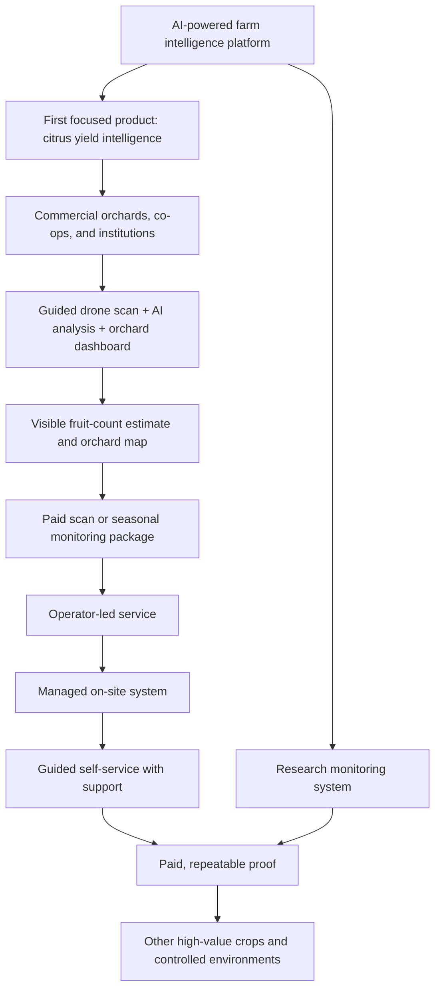
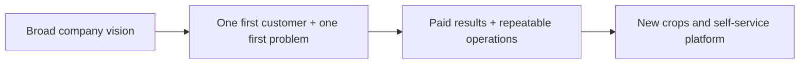

# Business Model: AI-Powered Farm Intelligence Platform

## The business in one sentence

> We are building an AI-powered farm intelligence platform. We begin with drone-based citrus yield estimation for Nueva Vizcaya orchards, then extend the same monitoring workflow to other high-value crops.

## Read this first: the important part

The company is **not a drone seller** and it is **not a generic data company**.

It sells decision-ready farm intelligence. The drone is one way to collect observations; the valuable outcome is a reliable answer to a farm decision.

Our first answer is:

> "How much citrus can this orchard realistically harvest, and where should the farm pay attention?"

This focus is essential. A broad platform vision is good; trying to build citrus, vegetables, hydroponics, poultry, and research tools at once is not.

## First product: Citrus yield intelligence

### Customer

Begin with commercial citrus orchards, cooperatives, and agricultural institutions in Nueva Vizcaya, especially those with a designated farm technician.

### Problem

Farms need earlier, more consistent visibility into visible fruit volume so they can plan labor, harvest timing, packing, buyer commitments, and field checks.

### Solution

The system maps registered orchard blocks, captures aerial images through a guided drone scan, uses AI to estimate visible fruit counts, and returns a clear orchard report and dashboard history.

The result must be described honestly as a **visible fruit-count estimate**, not a guaranteed total harvest. Leaves, branches, and canopy structure hide some fruit.

### Customer promise

> Select an orchard block, press Scan, receive a harvest estimate and orchard map.

The customer should not need to become a drone expert. The product needs preset scan paths, a guided checklist, image-quality checks, safe return-to-home behavior, and remote support.

## Revenue model

Start by selling outcomes, then make hardware access more self-service as the system proves reliable.

| Stage | What the customer buys | How we earn |
| --- | --- | --- |
| 1. Scan service | We operate the scan and deliver the report. | Per scan, per orchard/block, or seasonal package. |
| 2. Managed on-site system | The farm has a configured system; we manage setup, analysis, support, and maintenance. | Onboarding fee plus monthly, seasonal, or usage-based service. |
| 3. Self-service platform | A trained farm technician runs guided scans using purchased or leased hardware. | Hardware sale/lease plus software and support subscription. |

Illustrative early scan prices to validate with customers:

- Pilot or demonstration: PHP 1,500 to PHP 3,000
- Orchard/block scan: PHP 5,000 to PHP 15,000
- Larger cooperative, institutional, or custom project: PHP 20,000+

These are starting hypotheses, not final public prices. Every price must cover travel, operator time, batteries, repairs, cloud processing, storage, support, hardware replacement risk, and a healthy margin.

### Why software can be monthly

A monthly fee is justified only if the dashboard continues to help the farm: yield trends, scan history, map-based changes, planning reports, alerts, and management visibility. A one-time fruit count is a report, not yet recurring software.

## Hardware strategy

Do not lead by selling or freely renting drones. Early customers may create poor data through bad flights, poor charging, crashes, or inconsistent image capture, then blame the product.

Start with **supervised autonomy**: we control the workflow and quality, while gradually enabling a farm technician to operate it. Sell or lease hardware only after installation, training, support terms, and repeatable field performance.

If a drone costs about PHP 20,000 to build, a two-month rental at PHP 20,000 cannot be assumed profitable. Calculate the full operating cost before publishing that price.

## Research monitoring system: second revenue line

Researchers, universities, LGUs, and crop-development programs can pay for repeatable plant-monitoring workflows. This is a separate offer that uses the same core platform.

> We design and operate repeatable plant-monitoring workflows that collect, organize, and analyze field data for your research project.

Possible measurements include fruit counts, plant growth, canopy condition, time-series images, crop plots, treatments, trees, vegetables, and hydroponic systems.

The research customer receives a defined monitoring plan, consistent plant/plot IDs, scheduled data collection, dashboard access, quality checks, and exportable images and data.

Charge a one-time study setup fee, then a fee per scan, visit, month, plot, or season. Charge separately for hardware installation and genuinely new computer-vision analysis.

Only accept research projects that reuse a core capability: mapping, repeat monitoring, image capture, computer vision, or reporting. Otherwise the company risks becoming a custom software shop rather than building a scalable product.

## Competitive advantage

The defensible asset is not the drone itself. It is the combination of:

- A local Perante orange dataset and crop-specific AI model
- Orchard maps and repeat scan history
- A proven field workflow that creates consistent data
- Relationships with Nueva Vizcaya farms, co-ops, and researchers
- A software platform that turns raw imagery into useful decisions

## Expansion rule

The platform can expand to other high-value crops and controlled environments, but only after the first use case is paid and repeatable.

1. Prove that citrus customers pay and use the result.
2. Build a reliable local dataset and operating playbook.
3. Choose one adjacent crop with a clear economic decision and similar monitoring needs.
4. Run paid pilots.
5. Productize what repeats.

Poultry should not be an early expansion promise. Drone operations near animals raise welfare, safety, and biosecurity concerns and require a specific validated use case.

## Research partnership and IP rule

Research can validate the system, create data, and open grant opportunities. It must not quietly take ownership of the company technology.

Before a partnership, agree in writing on ownership of existing software and models, access to images and labels, ownership of improvements, confidentiality, publication review, and commercialization rights.

The intended relationship is simple: research strengthens the company; the company retains its core platform and commercial rights.

## What we must prove next

1. A commercial orchard, cooperative, or institution will pay for a citrus yield-estimate scan.
2. The estimate influences a real decision about harvest, labor, packing, or sales.
3. A scan can be completed safely and consistently in a real orchard.
4. A trained farm technician can eventually produce usable data with guided support.
5. The service remains profitable after travel, support, processing, and repair costs.

## Pitch position

For a competition or first customer conversation, lead with citrus. Use the platform vision only after the first problem is clear.

> We help Nueva Vizcaya citrus orchards estimate visible fruit yield using guided drone scans and AI, so they can plan harvest and sales with better information. This is the first application of our AI-powered farm intelligence platform.
