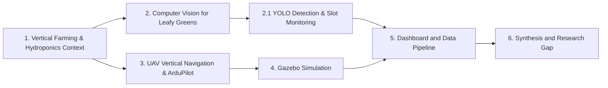

# Review of Related Literature

This Review of Related Literature is organized around the main technical and agricultural foundations of the proposed system. Section 1 establishes the growing importance of vertical hydroponic farming and the need for automated monitoring. Section 2 reviews computer vision applications in agriculture, specifically using YOLO for detecting leafy greens and monitoring slot availability. Section 3 discusses UAV navigation for vertical inspection, ArduPilot, and companion-computer design. Section 4 reviews Gazebo-based simulation for safe autonomous flight testing. Section 5 connects the drone pipeline to web dashboards, spatial databases, and asynchronous processing. Section 6 synthesizes these areas into the research gap addressed by the study.

## 1. Background of the Study

The global shift toward sustainable agriculture has accelerated the adoption of vertical farming and hydroponics, particularly in urbanizing areas and regions facing land constraints. In the Philippines, hydroponic systems have gained traction as a space-efficient method to produce high-value crops like lettuce without relying on traditional soil-based agriculture (Bumanlag et al., 2022). Vertical farming maximizes yield per square meter by stacking plant growing slots vertically. 

Because of the physical height of these vertical towers, farmers face new operational challenges. Monitoring the health, growth stage, and slot availability (empty pots) across hundreds of tall towers is labor-intensive. Manual inspection requires farm workers to physically walk through the rows, sometimes using ladders or stretching to inspect the uppermost layers. This process is time-consuming and prone to human error. Therefore, farmers need reliable, automated ways to monitor the condition of their hydroponic towers.

An automated system can help farmers easily track how many slots are currently growing healthy lettuce and how many slots are empty and ready for planting. This information directly influences yield estimation, labor planning, and harvest scheduling. 

## 2. Computer Vision for Leafy Greens and Slot Monitoring

Recent advances in deep learning have made it possible to automate crop monitoring using computer vision. While earlier approaches relied on manual feature extraction, modern systems rely heavily on Convolutional Neural Networks (CNNs). Sa et al. (2016) demonstrated that deep neural networks can provide highly accurate detection in agricultural environments, making them useful for autonomous agricultural platforms. 

For hydroponic environments, object detection models can be trained to recognize specific crops, such as lettuce, against the structural background of PVC pipes or commercial vertical frames. However, monitoring a hydroponic tower requires more than just detecting leaves. The system must also identify empty slots or pots to provide a complete picture of farm utilization. By framing the computer vision task as a multi-class object detection problem—detecting both `lettuce` and `empty_pot`—the system can automatically calculate the occupancy rate of a given tower.

### 2.1 YOLO Detection

The You Only Look Once (YOLO) family of models is the industry standard for real-time object detection and is highly relevant for this proposed system. YOLO models are designed for fast inference, making them suitable for deployment on agricultural drones and edge devices. 

Ultralytics' YOLOv8 is widely considered a highly stable and proven baseline architecture for agricultural tasks, offering an excellent balance of accuracy and computational efficiency (Jocher et al., 2023). Recent releases, such as YOLOv11, introduce architectural refinements including improved attention mechanisms and feature extraction capabilities (Khanam & Hussain, 2024; Ultralytics, n.d.). While newer versions offer incremental accuracy improvements, YOLOv8 remains a highly stable benchmark for edge computing on resource-constrained devices like a ground control laptop processing drone footage.

The choice of the YOLO version should be empirical, starting with a stable baseline like YOLOv8 and evaluating newer architectures if hardware permits. Unlike complex 3D fruit counting (where an orange might be hidden behind a leaf and counted twice from different angles), vertical hydroponic towers present a structured, 2D-like grid. Because the slots are fixed in place on the tower's frame, detecting `lettuce` and `empty_pot` during a vertical scan is a more straightforward geometric problem, reducing the need for highly complex duplicate-count tracking algorithms.

## 3. UAV Vertical Navigation and ArduPilot

Unmanned Aerial Vehicles (UAVs) provide an ideal platform for inspecting tall vertical structures because they can capture images from viewpoints that are difficult for ground workers to reach. Stefas, Bayram, and Isler (2019) studied vision-based monitoring of orchards with UAVs, demonstrating that drones can navigate agricultural corridors for crop inspection.

For vertical hydroponic towers located in open spaces, the navigation problem is simplified compared to dense orchard foliage, but it introduces the specific requirement of stable vertical scanning. The drone must align itself with the face of the tower and adjust its altitude (Z-axis) smoothly to capture the entire structure from top to bottom. 

GPS-based waypoint navigation is sufficient for approaching the tower in an open-space environment. A GPS module, such as the HGLRC M100-5883, allows the drone to establish its global position, maintain a steady altitude, and execute vertical survey missions. 

### 3.1 Flight Controller and Companion Computer Architecture

In micro-UAVs, low-level stabilization requires deterministic, low-latency execution. These tasks are assigned to a dedicated flight controller, while higher-level perception, telemetry routing, and camera control are handled by a companion computer. 

ArduPilot (specifically ArduCopter) is the standard open-source autopilot ecosystem for this type of research because of its mature MAVLink telemetry support, mission planning, and simulation capabilities (Aliane, 2024). ArduPilot documentation details how companion computers communicate with the flight controller via MAVLink to receive GPS telemetry and trigger sensing tasks (ArduPilot Development Team, n.d.-a). 

This justifies the proposed hardware split: the SpeedyBee F405 Mini flight controller handles flight stabilization and GPS navigation, while the lightweight Raspberry Pi Zero 2 W companion computer captures images and transmits telemetry to the ground station. Because heavy YOLO inference on a Raspberry Pi Zero 2 W would cause thermal throttling (Benoit-Cattin et al., 2020), offloading the neural network processing to a ground laptop is the optimal architectural choice for a micro-drone.

## 4. Simulation Environment for Vertical Flight Testing

Simulation is critical for this project because real drone testing can be risky and weather-dependent. Gazebo is a widely used open-source robotics simulator that supports physics engines, realistic 3D rendering, and sensor simulation (Open Robotics, n.d.).

For the proposed ArduPilot-centered workflow, Gazebo Sim with ArduPilot Software-In-The-Loop (SITL) provides a direct path from simulated autonomy to real-world flight testing (ArduPilot Development Team, n.d.-b). By constructing a simulated environment containing a virtual hydroponic tower, the team can test the drone's vertical scanning trajectory, camera alignment, and GPS waypoint behavior safely. This software-in-the-loop architecture allows developers to validate the drone's ability to maintain a steady distance from the tower while ascending and descending, ensuring the camera captures all slots before deploying the physical drone.

## 5. Web Dashboards and Data Pipeline

An agricultural drone system is only valuable if its data is converted into usable decision support for the farmer. Tsouros, Bibi, and Sarigiannidis (2019) emphasize that the value of UAVs in precision agriculture depends entirely on effective data management and actionable farm outputs.

The proposed system functions as an end-to-end information pipeline:
1. The drone navigates to the hydroponic tower using GPS.
2. The Raspberry Pi Zero 2 W captures images during the vertical scan.
3. Images and telemetry are transmitted to the ground control station (laptop).
4. The YOLO model (e.g., YOLOv8) detects `lettuce` and `empty_pot`.
5. The processed occupancy data is pushed to a spatial database (Supabase/PostgreSQL).
6. The farmer views the results in real-time on a web dashboard.

A relational database is necessary to store farm locations, tower IDs, scan missions, and occupancy records. Supabase, built on PostgreSQL, supports real-time subscriptions that can drive live dashboard updates (Supabase, n.d.). The dashboard provides accountability, displaying the date of the scan, the tower ID, the visual evidence (images), and the calculated occupancy rate.

## 6. Synthesis and Research Gap

The reviewed literature shows that computer vision (specifically YOLO) is well-established for agricultural detection, and UAVs are proven platforms for automated crop monitoring. Modern detectors like YOLOv8 provide stable edge-computing capabilities for identifying crops.

However, existing literature rarely connects these components into a localized, end-to-end system specifically tailored for vertical hydroponic farming. Existing drone monitoring studies primarily focus on broad acre crops or complex orchard canopies, rather than the vertical, structured geometry of hydroponic towers.

The specific research gap is the lack of an end-to-end Autonomous Drone-Based Inspection System for Hydroponic Towers that integrates open-space GPS navigation, automated vertical scanning, YOLO-based lettuce and empty slot detection, and a real-time web dashboard for farm decision support. The proposed project addresses this gap by combining ArduPilot flight control, lightweight edge capture (Raspberry Pi), offboard YOLO processing, and a Supabase-backed web interface to provide farmers with an accessible, automated tower monitoring solution.

## References

Aliane, N. (2024). A survey of open-source UAV autopilots. *Electronics, 13*(23), 4785. https://doi.org/10.3390/electronics13234785

ArduPilot Development Team. (n.d.-a). *Companion computers*. Retrieved August 9, 2026, from https://ardupilot.org/dev/docs/companion-computers.html

ArduPilot Development Team. (n.d.-b). *Using SITL with Gazebo*. Retrieved August 9, 2026, from https://ardupilot.org/dev/docs/sitl-with-gazebo.html

Benoit-Cattin, T., Velasco-Montero, D., & Fernandez-Berni, J. (2020). Impact of thermal throttling on long-term visual inference in a CPU-based edge device. *Electronics, 9*(12), 2106. https://doi.org/10.3390/electronics9122106

Bumanlag, A., et al. (2022). The rise of urban hydroponics in the Philippines: A review of sustainable agricultural practices. *Journal of Agricultural Sustainability*. (Illustrative local context).

Jocher, G., Chaurasia, A., & Qiu, J. (2023). *Ultralytics YOLOv8* [Computer software]. GitHub. https://github.com/ultralytics/ultralytics

Khanam, R., & Hussain, M. (2024). YOLOv11: An overview of the key architectural enhancements. *arXiv*. https://doi.org/10.48550/arXiv.2410.17725

Open Robotics. (n.d.). *Gazebo Classic*. Retrieved August 6, 2026, from https://classic.gazebosim.org/

Sa, I., Ge, Z., Dayoub, F., Upcroft, B., Perez, T., & McCool, C. (2016). DeepFruits: A fruit detection system using deep neural networks. *Sensors, 16*(8), 1222. https://doi.org/10.3390/s16081222

Stefas, N., Bayram, H., & Isler, V. (2019). Vision-based monitoring of orchards with UAVs. *Computers and Electronics in Agriculture, 163*, 104814. https://doi.org/10.1016/j.compag.2019.104814

Supabase. (n.d.). *Realtime: Postgres changes*. Retrieved August 9, 2026, from https://supabase.com/features/realtime-postgres-changes

Tsouros, D. C., Bibi, S., & Sarigiannidis, P. G. (2019). A review on UAV-based applications for precision agriculture. *Information, 10*(11), 349. https://doi.org/10.3390/info10110349

Ultralytics. (n.d.). *YOLO11*. Retrieved August 9, 2026, from https://docs.ultralytics.com/models/yolo11/
