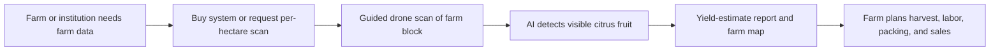
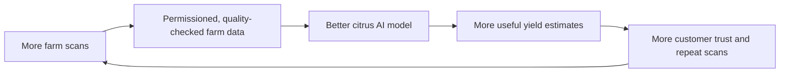

# Business Model: GrowKita - AI Farm Intelligence

## What we sell

GrowKita sells an **AI farm intelligence system** that helps farms turn drone scans into decision-ready harvest insights.

Our first product is built for citrus farms in Nueva Vizcaya. Using a guided drone scan and AI fruit detection, GrowKita shows:

- an estimated visible citrus fruit count
- a farm/block map showing where fruit was observed
- a harvest-planning summary for labor, packing, and buyer discussions

In plain language: **we do not only sell a drone. We sell farm intelligence.**

The drone is the hardware. The software is the brain. The report is the value.

### Why we start with citrus

We start with citrus, specifically Perante orange farms in Nueva Vizcaya, because a focused first market lets us build a reliable local dataset, prove that customers will pay, and refine one field workflow before expanding.

We are not claiming to solve every farm-monitoring problem on day one. Citrus is the first product that makes the larger platform credible.

> Important: the result is a visible fruit-count estimate, not a guaranteed total harvest. Some fruit is hidden by leaves and branches.

## Who pays us first

Our first customers are commercial citrus farms, cooperatives, and agricultural institutions in Nueva Vizcaya.

They are a better starting market than individual small growers because they manage more trees, make larger harvest decisions, and can assign a farm technician to work with the system.

## Why they would pay

Before harvest, farms need a better answer to: **How much fruit can we expect, and where is it?**

That information helps them plan:

- how many workers to prepare
- when to harvest each farm block
- packing and transport needs
- what volume they can discuss with buyers
- which areas need a manual field check

## How GrowKita works

At the start, our team can operate or supervise scans to protect data quality while we improve the workflow. For larger customers, GrowKita can also sell the complete drone-and-software package and train their staff to use it.

## How we make money

### 1. Drone + software package: main product sale

GrowKita sells a complete package to larger farms, cooperatives, universities, LGUs, and research customers:

- configured drone
- GrowKita scanning and dashboard software
- AI citrus fruit-count model
- onboarding and training
- basic documentation and operating workflow

This is easier for serious customers to understand: they buy the capability, not just a service visit.

Initial validation estimate:

- Drone-and-software system package: around PHP 100,000 to PHP 150,000 depending on drone build, sensors, setup, training, and included support
- Institutional or research package: custom pricing based on study duration, data needs, and training requirements

These numbers are not final. They must be validated with agricultural experts, possible buyers, prototype cost, field reliability, software scope, training time, and support load.

### 2. Per-hectare scanning service: accessible entry offer

Not every farmer will buy a drone-and-software system. For them, GrowKita offers a scanning service priced per hectare.

The farm pays based on the area scanned and receives the report.

- Farm survey scan: PHP 5,000 to PHP 10,000 per hectare, depending on travel, terrain, farm layout, and report detail
- Cooperative, institutional, or larger project: custom quotation

Per-hectare pricing is strong because agricultural customers already think in land area. It also makes the offer easier to explain in a pitch.

### 3. Training, maintenance, and support: after-sale revenue

The software does not need to be sold as a mandatory monthly subscription at the start. Instead, we can earn from practical support:

- setup and onboarding
- operator training
- maintenance and repair coordination
- AI model updates
- data backup and report generation support
- custom research dashboards or exports

This avoids scaring local buyers with subscription fees while still creating future recurring revenue.

### 4. Seasonal monitoring: repeat service revenue

For farms that want continuous planning support, GrowKita can offer scheduled scans during the season. The value is not the scan alone; it is the comparison over time.

Seasonal monitoring can show:

- changes in visible fruit count
- farm blocks that need manual checking
- harvest-readiness trends
- comparison against previous scans

## What makes us different

Anyone can buy a drone. Our advantage is the complete local system:

- Perante orange images and a crop-specific AI model
- Farm maps and repeat scan history
- A reliable field workflow for producing usable images
- A dashboard that turns images into a clear farm decision
- Local relationships with Nueva Vizcaya growers and agricultural partners

This matters because a drone without a good workflow can produce poor data. GrowKita's value is the whole system: hardware, AI, guided scanning, dashboard, report, training, and local crop knowledge.

## Data advantage: improving the AI over time

Each completed scan can improve the system. With the farm's permission, images, fruit-count observations, scan conditions, and verified harvest results can be used to train and evaluate better AI models.

This creates a data flywheel:

The goal is not to resell a specific farm's raw images or confidential records. Farms must retain control of their identifiable data.

Later, and only with clear consent and appropriate privacy safeguards, we may offer aggregated and anonymized market insights. For example, a cooperative, buyer, or agricultural organization may pay for regional crop-volume trends that do not reveal any individual farm's identity, location, or confidential production data.

Every customer agreement should clearly state:

- what data we collect
- who owns the raw images and identifiable farm records
- whether the farm permits model training
- whether anonymized, aggregated insights may be created
- how the farm can opt out

This is both an ethical choice and a business advantage. Farmers will share better data when they understand the benefit and trust that we will not expose their operation.

## Where the company goes next

Our company vision is broader than citrus, but our first business is deliberately narrow.

> GrowKita is building an AI-powered farm intelligence platform. We begin with drone-based citrus yield estimation for Nueva Vizcaya farms, then extend the same monitoring workflow to other high-value crops.

After citrus customers pay and the workflow is repeatable, we can adapt the platform to other crops and controlled environments such as hydroponics. Every new market must first pass a paid pilot; we will not build every crop solution at once.

## Research customers: an additional path

Universities, LGUs, and crop researchers may also pay us to set up repeatable plant-monitoring studies. We can collect scheduled images and measurements, organize them by plant or plot, and provide a dashboard and exportable dataset.

This can be sold as a complete automation package: drone setup, software dashboard, data-collection workflow, and study-specific reporting. It helps us earn project income, validate methods, and improve the platform while citrus remains the first commercial use case.

## What we need to prove

1. Larger customers will buy the drone-and-software package.
2. Farms will pay per hectare for a citrus yield-estimate scan.
3. The estimate improves a real decision about harvest, labor, packing, or sales.
4. We can complete scans safely and consistently in real farms.
5. Training and support can create repeat revenue without forcing a subscription.
