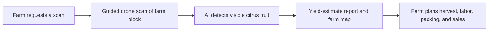
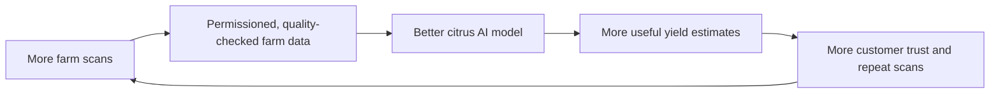

# Business Model: GrowKita - Citrus Yield Intelligence

## What we sell

GrowKita provides a **Citrus Yield Intelligence Service** for farms in Nueva Vizcaya.

Using a guided drone scan and AI fruit detection, we give a farm a simple report showing:

- its estimated visible citrus fruit count
- a farm/block map of where the fruit was observed
- a harvest-planning summary for labor, packing, and buyer discussions

In plain language: **we scan a farm and turn images into a useful harvest estimate.**

### Why we start with citrus

We start with citrus, specifically Perante orange farms in Nueva Vizcaya, because a focused first market lets us build a reliable local dataset, prove that customers will pay, and refine one field workflow before expanding.

We are not claiming to solve every farm-monitoring problem on day one. Citrus is the first product that makes the larger platform credible.

> Important: the result is a visible fruit-count estimate, not a guaranteed total harvest. Some fruit is hidden by leaves and branches.

## Who pays us first

Our first customers are commercial citrus farms, cooperatives, and agricultural institutions in Nueva Vizcaya.

They are a better starting market than individual small growers because they manage more trees, make larger harvest decisions, and can assign a farm technician to work with the system.

## Why they would pay

Before harvest, farms need a better answer to: **How much fruit can we expect, and where is it?**

That information helps them plan:

- how many workers to prepare
- when to harvest each farm block
- packing and transport needs
- what volume they can discuss with buyers
- which areas need a manual field check

## How the service works

At the start, our team operates or supervises the scan. This protects data quality while we improve the workflow. Later, trained farm staff can run guided scans, while we provide the software, support, and maintenance.

## How we make money

### 1. Farm scan service: first revenue

The farm pays us to scan a farm block and receive the report.

- Pilot scan: PHP 1,500 to PHP 3,000
- Standard farm/block scan: PHP 5,000 to PHP 15,000
- Cooperative, institutional, or larger custom project: PHP 20,000+

These are initial test prices. We will refine them after measuring travel, labor, batteries, repairs, cloud processing, and customer willingness to pay.

### 2. Seasonal monitoring package: repeat revenue

The farm pays for scheduled scans throughout the season. It receives updated estimates, scan history, and comparison reports.

This is the most important long-term service because farms should pay for recurring planning value, not only one report.

### 3. Managed system for larger farms: later revenue

Once the workflow is proven, larger farms can have a configured drone system on-site. We charge for installation, software, support, maintenance, and usage.

We do **not** start by simply selling or renting drones. A drone flown incorrectly creates poor data and damages customer trust. Hardware sales or leasing come after training and reliable guided operations.

## What makes us different

Anyone can buy a drone. Our advantage is the complete local system:

- Perante orange images and a crop-specific AI model
- Farm maps and repeat scan history
- A reliable field workflow for producing usable images
- A dashboard that turns images into a clear farm decision
- Local relationships with Nueva Vizcaya growers and agricultural partners

## Data advantage: improving the AI over time

Each completed scan can improve the system. With the farm's permission, images, fruit-count observations, scan conditions, and verified harvest results can be used to train and evaluate better AI models.

This creates a data flywheel:

The goal is not to resell a specific farm's raw images or confidential records. Farms must retain control of their identifiable data.

Later, and only with clear consent and appropriate privacy safeguards, we may offer aggregated and anonymized market insights. For example, a cooperative, buyer, or agricultural organization may pay for regional crop-volume trends that do not reveal any individual farm's identity, location, or confidential production data.

Every customer agreement should clearly state:

- what data we collect
- who owns the raw images and identifiable farm records
- whether the farm permits model training
- whether anonymized, aggregated insights may be created
- how the farm can opt out

This is both an ethical choice and a business advantage. Farmers will share better data when they understand the benefit and trust that we will not expose their operation.

## Where the company goes next

Our company vision is broader than citrus, but our first business is deliberately narrow.

> GrowKita is building an AI-powered farm intelligence platform. We begin with drone-based citrus yield estimation for Nueva Vizcaya farms, then extend the same monitoring workflow to other high-value crops.

After citrus customers pay and the workflow is repeatable, we can adapt the platform to other crops and controlled environments such as hydroponics. Every new market must first pass a paid pilot; we will not build every crop solution at once.

## Research customers: an additional path

Universities, LGUs, and crop researchers may also pay us to set up repeatable plant-monitoring studies. We can collect scheduled images and measurements, organize them by plant or plot, and provide a dashboard and exportable dataset.

This is a second revenue line, not our main first pitch. It helps us earn project income, validate methods, and improve the platform while citrus remains the first commercial use case.

## What we need to prove

1. Farms will pay for a citrus yield-estimate scan.
2. The estimate improves a real decision about harvest, labor, packing, or sales.
3. We can complete scans safely and consistently in real farms.
4. Seasonal monitoring creates repeat customers.
5. The service is profitable after the real cost of operating it.
