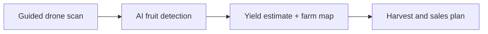
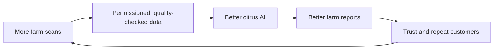

# PowerPoint Plan: GrowKita

## Deck purpose

This is a business-pitch deck for the NVSU Business Pitch Competition / Young Farmers Challenge. It must make one point clear:

> GrowKita sells AI-powered farm intelligence through a drone-and-software system, with per-hectare scanning available for farms that want the report without buying the full system.

Do not present the venture as a company that already solves every crop, vegetable, hydroponic, and poultry problem. Citrus is the first product. The larger farm-intelligence platform is the credible future.

Do not claim that GrowKita is the first AI-and-drone agriculture company in the Philippines. Other Philippine drone and AI agriculture projects already exist. Instead, present the ambition truthfully: **GrowKita aims to make AI-powered farm intelligence practical for local farms, beginning with Nueva Vizcaya citrus.**

## Slide 1: Title / hook

**On-screen text**

**GrowKita**

AI-powered farm intelligence.

Starting with citrus yield estimation for Nueva Vizcaya farms.

**Visual**

A strong full-slide photo of a real citrus tree or farm in Nueva Vizcaya, with visible orange fruit. Place the title over the image with a dark, readable overlay. Include team name, NVSU, and competition name in small text at the bottom.

**Speaker point**

GrowKita helps farms make harvest and buyer decisions before the exact available fruit volume is known. We begin by giving citrus farms an earlier estimate.

## Slide 2: Our vision

**On-screen text**

### We want to make AI-powered farm intelligence practical for Philippine agriculture.

- Monitor plants and farm conditions using AI and computer vision
- Turn field images into clear, decision-ready insights
- Build one monitoring platform that can grow across high-value crops and research applications

**Our first step: citrus yield estimation in Nueva Vizcaya.**

**Visual**

A full-width farm landscape or aerial agricultural image. Overlay a restrained network of three labels: **Observe**, **Understand**, and **Act**. Add small, clear icons for AI, camera/drone, and farm data. Do not show many crop categories yet.

**Speaker point**

Agriculture is entering an AI era, but local farms still need practical tools that turn technology into decisions. GrowKita will build that bridge, starting with one real problem we can solve well.

## Slide 3: Why we start with citrus

**On-screen text**

### Start local. Prove value. Then scale.

Nueva Vizcaya is known for Perante oranges. Citrus gives GrowKita a focused first market where we can:

- build a local, crop-specific AI dataset
- work with nearby farms and agricultural partners
- prove that farmers will pay for useful yield insights

**First product: citrus yield intelligence.**

**Visual**

A simple Nueva Vizcaya map silhouette with a citrus marker beside a high-quality photo of Perante oranges on the tree. Connect the map to the phrase: "Local crop. Local data. Local proof."

**Speaker point**

We are not starting with citrus because our ambition is small. We are starting there because focus makes the wider platform credible.

## Slide 4: The problem

**On-screen text**

### Before harvest, farms are forced to estimate.

- How much fruit can we expect?
- How many workers should we prepare?
- What volume can we commit to buyers?

Manual counting is slow, inconsistent, and difficult across many trees.

**Visual**

One real photo of a worker inspecting a fruit tree. Beside it, use three simple icons: workers, harvest crates, and a handshake/truck for buyer commitments. Avoid a generic drone image here; the focus is the farmer's problem.

**Speaker point**

The issue is not that farmers lack information. They lack timely, consistent information at the scale needed for planning.

## Slide 5: The solution

**On-screen text**

### The drone captures the farm. The software turns it into decisions.

1. Scan the farm block
2. AI detects visible fruit
3. Farm receives a yield estimate and map

**Visual**

Use a clean diagram with a drone photo or small drone icon above the first step. This should be one of the simplest slides in the deck.

**Speaker point**

GrowKita is not only selling hardware. The drone is the tool, the software is the brain, and the report is the value.

## Slide 6: What the farm receives

**On-screen text**

### A report a farm can act on.

- Estimated visible fruit count
- Map by farm block
- Areas needing a manual check
- Scan history for seasonal comparison

**Visual**

A realistic dashboard mockup based on your project: farm map, selected tree/block, fruit-count estimate, scan date, and a small history chart. Do not use fake crowded analytics. One map and three large, readable results are enough.

**Speaker point**

Be precise: this is a visible fruit-count estimate, not a guaranteed total harvest. That honesty builds trust.

## Slide 7: How we make money

**On-screen text**

### Two ways to buy GrowKita.

| Full system package | Per-hectare scan service | Support and training |
| --- | --- | --- |
| Drone + software + AI model | GrowKita scans the farm | Setup, maintenance, updates |
| For co-ops, LGUs, research, larger farms | For farms that only need the report | Not required as a monthly subscription |

Price estimates:

- System package: PHP 100,000 to PHP 150,000
- Farm survey scan: PHP 5,000 to PHP 10,000 per hectare
- Co-op/research/custom project: quotation

**Visual**

Use the table as the visual. Make the two buying paths very clear: buy the system, or pay per hectare for GrowKita to scan and report. Add a small note: "Prices are validation-stage estimates and may change after expert review, prototype costing, and field testing."

**Speaker point**

This is easier for the market to understand: customers either buy the capability or pay for the result by hectare. The prices are not final; they are starting estimates we will validate with experts, prototype cost, and real customers.

## Slide 8: Why we can win

**On-screen text**

### Our advantage is the local system, not just the drone.

- Perante orange dataset and crop-specific AI
- Farm maps and repeat scan history
- Field workflow designed for local farms
- NVSU and Nueva Vizcaya agricultural network

**Visual**

Use a four-part circular diagram around the words "Better farm intelligence": Local data, AI model, field workflow, and trusted partnerships. Add a small Perante orange photo, not a stock technology background.

**Speaker point**

Other people can buy drones. Our defensible asset is local data plus a repeatable process that produces useful reports.

## Slide 9: The data flywheel

**On-screen text**

### Every permissioned scan improves the system.

**Visual**

Add one short note under the diagram: "Farm-identifiable data stays protected; aggregate insights require clear consent."

**Speaker point**

We do not build a business by selling a farm's private records. With permission, data helps improve the AI. In the future, aggregated and anonymized crop insights may serve co-ops, buyers, and agricultural organizations.

## Slide 10: Growth path

**On-screen text**

### Citrus first. Farm intelligence next.

1. Prove paid citrus scans in Nueva Vizcaya
2. Build repeat seasonal monitoring
3. Enable guided scans by trained farm technicians
4. Run paid pilots for the next high-value crop or controlled environment

**Visual**

A horizontal four-step timeline. Citrus and Nueva Vizcaya should be visually largest at Step 1. Show trees, vegetables, crops, research plots, and controlled environments as small, muted future icons only at Step 4. Do not include poultry in this deck until there is a specific, validated monitoring use case.

**Speaker point**

GrowKita is scalable because the workflow repeats, but we expand only after the first market is working and the system is reliable enough to sell or operate per hectare.

## Slide 11: Future applications

**On-screen text**

### One monitoring platform. More farm applications.

After citrus proves the workflow, GrowKita can validate adjacent use cases:

- **Hydroponics:** repeat plant observations and growth tracking
- **Trees and crops:** plant inventory, canopy change, and targeted field checks
- **Animal facilities:** monitoring of zones and operations, subject to welfare and biosecurity validation

**Visual**

Use three equal, simple image frames: a hydroponic tower, a tree/crop field, and a poultry or livestock facility. Under every image, show one concise outcome. Add a small footer: "Future pilots, validated with customers."

**Speaker point**

The shared capability is not just a drone. It is the repeatable workflow: observe, organize data, analyze with AI, and return a useful decision. Each new use case must earn its place through a paid pilot.

## Slide 12: Pilot plan and ask

**On-screen text**

### Our next step: prove value with local farms.

We are seeking:

- Pilot citrus farms or cooperatives
- Agricultural mentors and validation partners
- Support for field testing, data collection, and model improvement

Success looks like:

**A farm that uses our report to make a better harvest decision and pays to use it again.**

**Visual**

Use a real team photo or a confident photo of the prototype/drone in a citrus-farm setting. Keep the ask on a clean solid background, not in a card.

**Speaker point**

We are not asking people to believe in a distant future. We are asking for the chance to prove a useful, local product with measurable farm value.

## Optional Slide 13: Team

Use this only if the competition requires a team introduction or gives enough time.

**On-screen text**

### The team building the first version

For each member: name, role, and one credibility point.

Suggested role split:

- Computer vision and software
- Drone, mapping, and field operations
- Customer research, partnerships, and business operations

**Visual**

Professional team photos or clean name-and-role layout. Add a small photo of the team testing the project if available.

## Final slide: Closing statement

**On-screen text**

> The future of farming will not be guessed. It will be measured.

**GrowKita**

AI-powered farm intelligence, starting in Nueva Vizcaya.

**Visual**

Use a clean, full-slide image of a Perante citrus farm at sunrise or a team testing the drone in a real farm setting. The quote should be the only large text.

**Speaker point**

GrowKita begins with citrus, but the mission is larger: make better farm decisions possible through local data, AI, and practical automation.

**Why this instead of a "be first and get rich" quote**

This closing statement is original to GrowKita. It sounds confident and ambitious while keeping the focus on the farmer outcome and the venture's purpose.

## Design rules

- Use real local citrus and farm images whenever possible.
- One main message per slide; do not turn the slide into speaker notes.
- Keep body text large enough to read at the back of a room.
- Use green, orange, charcoal, and white as a restrained agriculture palette.
- Say "farm" consistently, not "orchard."
- Say "visible fruit-count estimate," never promise exact harvest totals.
- The future platform appears only after Slides 1-8 prove the first citrus business.
