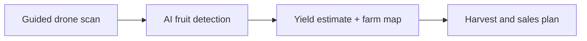
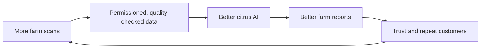

# PowerPoint Plan: AgriSuri

## Deck purpose

This is a business-pitch deck for the NVSU Business Pitch Competition / Young Farmers Challenge. It must make one point clear:

> AgriSuri helps Nueva Vizcaya citrus farms estimate visible fruit yield using guided drone scans and AI, so they can plan harvest and sales with better information.

Do not present the venture as a company that already solves every crop, vegetable, hydroponic, and poultry problem. Citrus is the first product. The larger farm-intelligence platform is the credible future.

## Slide 1: Title / hook

**On-screen text**

**AgriSuri**

AI-powered farm intelligence.

Starting with citrus yield estimation for Nueva Vizcaya farms.

**Visual**

A strong full-slide photo of a real citrus tree or farm in Nueva Vizcaya, with visible orange fruit. Place the title over the image with a dark, readable overlay. Include team name, NVSU, and competition name in small text at the bottom.

**Speaker point**

AgriSuri helps farms make harvest and buyer decisions before the exact available fruit volume is known. We begin by giving citrus farms an earlier estimate.

## Slide 2: The problem

**On-screen text**

### Before harvest, farms are forced to estimate.

- How much fruit can we expect?
- How many workers should we prepare?
- What volume can we commit to buyers?

Manual counting is slow, inconsistent, and difficult across many trees.

**Visual**

One real photo of a worker inspecting a fruit tree. Beside it, use three simple icons: workers, harvest crates, and a handshake/truck for buyer commitments. Avoid a generic drone image here; the focus is the farmer's problem.

**Speaker point**

The issue is not that farmers lack information. They lack timely, consistent information at the scale needed for planning.

## Slide 3: Our first customer and first use case

**On-screen text**

### We start with citrus farms in Nueva Vizcaya.

First customers:

- Commercial citrus farms
- Cooperatives
- Agricultural institutions

First decision we improve: **harvest planning.**

**Visual**

A simple Nueva Vizcaya map silhouette with a citrus marker, plus one photo of Perante oranges. Keep it local and specific.

**Speaker point**

We start narrow on purpose. A local, crop-specific workflow lets us build trust, collect better data, and prove customers will pay before expanding.

## Slide 4: The solution

**On-screen text**

### A guided drone scan becomes a harvest estimate.

1. Scan the farm block
2. AI detects visible fruit
3. Farm receives a yield estimate and map

**Visual**

Use a clean diagram with a drone photo or small drone icon above the first step. This should be the simplest slide in the deck.

**Speaker point**

AgriSuri is not selling a drone. We are selling a decision-ready report that helps the farm plan.

## Slide 5: What the farm receives

**On-screen text**

### A report a farm can act on.

- Estimated visible fruit count
- Map by farm block
- Areas needing a manual check
- Scan history for seasonal comparison

**Visual**

A realistic dashboard mockup based on your project: farm map, selected tree/block, fruit-count estimate, scan date, and a small history chart. Do not use fake crowded analytics. One map and three large, readable results are enough.

**Speaker point**

Be precise: this is a visible fruit-count estimate, not a guaranteed total harvest. That honesty builds trust.

## Slide 6: How we make money

**On-screen text**

### Start with a service. Grow into a platform.

| Now | Next | Later |
| --- | --- | --- |
| Paid farm scan | Seasonal monitoring | Managed on-site system |
| We operate or supervise | Repeat scans and reports | Guided farm-staff scans with our software and support |

Initial price tests:

- Pilot: PHP 1,500 to PHP 3,000
- Farm/block scan: PHP 5,000 to PHP 15,000
- Large/co-op/custom project: PHP 20,000+

**Visual**

Use the table as the visual. Add a small arrow moving from "service" to "managed system". Do not put rental or drone-sale prices on this slide yet; those are later operating choices, not the core business.

**Speaker point**

We begin with paid results because it lets us control quality and learn. Recurring seasonal monitoring is the target revenue model.

## Slide 7: Why we can win

**On-screen text**

### Our advantage is the local system, not just the drone.

- Perante orange dataset and crop-specific AI
- Farm maps and repeat scan history
- Field workflow designed for local farms
- NVSU and Nueva Vizcaya agricultural network

**Visual**

Use a four-part circular diagram around the words "Better farm intelligence": Local data, AI model, field workflow, and trusted partnerships. Add a small Perante orange photo, not a stock technology background.

**Speaker point**

Other people can buy drones. Our defensible asset is local data plus a repeatable process that produces useful reports.

## Slide 8: The data flywheel

**On-screen text**

### Every permissioned scan improves the system.

**Visual**

Add one short note under the diagram: "Farm-identifiable data stays protected; aggregate insights require clear consent."

**Speaker point**

We do not build a business by selling a farm's private records. With permission, data helps improve the AI. In the future, aggregated and anonymized crop insights may serve co-ops, buyers, and agricultural organizations.

## Slide 9: Growth path

**On-screen text**

### Citrus first. Farm intelligence next.

1. Prove paid citrus scans in Nueva Vizcaya
2. Build repeat seasonal monitoring
3. Enable guided scans by trained farm technicians
4. Run paid pilots for the next high-value crop or controlled environment

**Visual**

A horizontal four-step timeline. Citrus and Nueva Vizcaya should be visually largest at Step 1. Show vegetables and hydroponics as small, muted future icons only at Step 4. Do not include poultry in this deck.

**Speaker point**

AgriSuri is scalable because the workflow repeats, but we expand only after the first market is working.

## Slide 10: Pilot plan and ask

**On-screen text**

### Our next step: prove value with local farms.

We are seeking:

- Pilot citrus farms or cooperatives
- Agricultural mentors and validation partners
- Support for field testing, data collection, and model improvement

Success looks like:

**A farm that uses our report to make a better harvest decision and pays to use it again.**

**Visual**

Use a real team photo or a confident photo of the prototype/drone in a citrus-farm setting. Keep the ask on a clean solid background, not in a card.

**Speaker point**

We are not asking people to believe in a distant future. We are asking for the chance to prove a useful, local product with measurable farm value.

## Optional Slide 11: Team

Use this only if the competition requires a team introduction or gives enough time.

**On-screen text**

### The team building the first version

For each member: name, role, and one credibility point.

Suggested role split:

- Computer vision and software
- Drone, mapping, and field operations
- Customer research, partnerships, and business operations

**Visual**

Professional team photos or clean name-and-role layout. Add a small photo of the team testing the project if available.

## Design rules

- Use real local citrus and farm images whenever possible.
- One main message per slide; do not turn the slide into speaker notes.
- Keep body text large enough to read at the back of a room.
- Use green, orange, charcoal, and white as a restrained agriculture palette.
- Say "farm" consistently, not "orchard."
- Say "visible fruit-count estimate," never promise exact harvest totals.
- The future platform appears only after Slides 1-7 prove the first citrus business.
